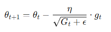

# 1주차(25.01.22)

1. **주차 회고록** 

<aside>

**사전 과제 |** 

**이전에 들어보지 못했던 개념인 모멘텀과 같은 개념들과 수식 측면에서 이해하지 못했던 시그모이드, cross-entropy와 같은 수식들을 이해할 수 있었다.**

</aside>

<aside>

**오늘의 KPT |** 

**Keep : 누락 데이터를 어떻게 처리할 것인가? → 상황에 따라 다르다. 시계열 데이터의 경우 보간. null값이 의미가 있다면 그대로 사용할 수도 있음.** 

**Problem : 머신러닝 vs 딥러닝의 차이가 무엇인지? 경사하강법에서 에이다 그리드, RMSProp, 아담에서 왜 아담이 제일 좋은 성능인지?**

**Try : 리뷰 과제**

</aside>

1. **리뷰 과제** 

<aside>

**딥러닝 vs 머신러닝**

- 딥러닝은 머신러닝의 하위 분야이고, 딥러닝은 인공신경망을 사용함
- Feature 추출에서 머신러닝은 사람이 데이터를 분석하고 feature를 수동으로 설계하지만 딥러닝은 신경망을 통해 데이터를 분석하고 특징을 자동으로 학습함
- 모델 구조에서 머선러닝은 선형 회귀, decision tree등과 같은 단순한 알고리즘을 사용하지만 딥러닝은 최소3개의 다층 신경망을 사용함
- 또한 딥러닝은 비지도학습(GAN등), 지도학습(이미지 분류), 강화학습 등 다양한 학습 방법을 가짐

**경사하강법 최적화에서 AdaGrad vs RMSProp vs Adam**

에이다 그래드

: 각 파라미터에 대해 이전까지의 모든 기울기 제곱 합을 저장하고, 이를 이용해 학습률을 조정함. 이는 자주  업데이트되는 파라미터의 학습률은 줄이고, 드물게 업데이트되는 파라미터의 학습량은 유지되도록 함.

다음과 같은 수식으로 이루어지며, 이 때 

다음 식이 현재까지의 기울기 제곱 합이며, 이것이 분모로 들어가 학습률을 줄이는 식으로 작용함.

장점 : 희소한 feature에 대한 학습률을 유지해 희소 데이터 처리에 적합. 학습률을 동적으로 조성해 초기 학습률을 세밀하게 튜닝하지 않아도 됨.

단점 : 기울기 제곱 합이 계속 누적되어 학습률이 지나치게 작아지는 문제 발생

RMSProp

: 에이다그래드의 학습률 감소 문제를 해결하기 위해 기울기 제곱의 누적값을 지수이동평균으로 대체.

지수 이동 평균은 다음 식으로 이루어짐. 특징은 최근 데이터에 더 높은 가중치를 부여한다는 것. 이를 통해 학습률을 안정적으로 조정할 수 있음

γ은 감쇠 계수로 일반적으로 0.9의 값을 가짐. gt는 현재 기울기의 의미.

장점 : AdaGrad의 학습률 감소 문제 해결

단점 : 모멘텀이 없어 방향 추적이 약함

학습률 조정은 다음과 같은 식으로 이루어짐.

Adam

: RMSProp과 모멘텀을 결합하여 기울기 방향과 학습률 조정을 동시에 효과적으로 하는 방법.

전체 학습률 조정은 다음과 같으며 

여기서 기울기 제곱의 지수 이동 평균은 다음과 같은 식으로 구하며 β2는 2차 모멘텀 계수로 일반적으로 0.999의 값을 가짐. 

이는 바이어스 보정을 거치고, 

분자의 경우 기울기의 지수 이동 평균을 구하여 계산

이도 마찬가지로 바이어스 보정을 거침

바이어스 보정을 하는 이유는 초기 단계(v t-1 = 0인 경우)에서 기울기가 모멘텀 계수에 의해 과소평가되는 것을 막기 위함.

</aside>